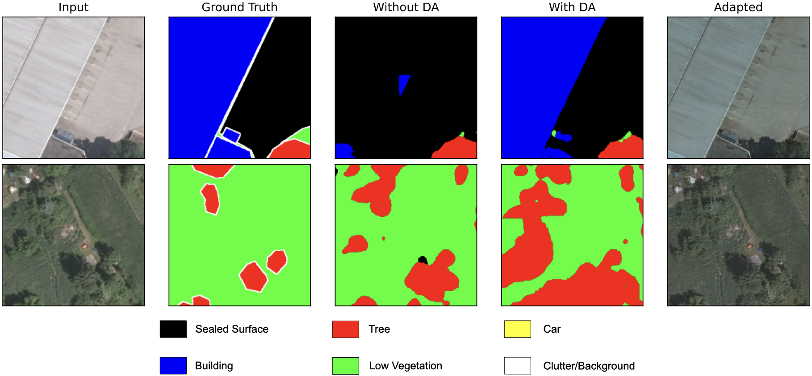

# FFT-based Appearance Adaptation
Reference implementation for the method described in the paper "FFT-based Appearance Adaptation for the Semantic Segmentation of Small-scale Aerial Image Datasets" to be published at [ICMV 2025](https://icmv.org/). It builds on our previous work, [SegForestNet](https://github.com/gritzner/SegForestNet). The successor to this work is available [here](https://github.com/gritzner/BSPDA).

Please cite our paper if you use anything from this repository, even features that are not documented in this or the previous paper, e.g., vector quantization, a DCT side-channel, skip connections that jump over our model's decoders, etc. We will update this citation once the proceedings are actually available.

```bibtex
@inproceedings{gritzner2025icmv,
  title={FFT-based Appearance Adaptation for the Semantic Segmentation of Small-scale Aerial Image Datasets},
  author={Gritzner, Daniel and Ysker, Sven and Ostermann, Jörn},
  booktitle={To appear in the Proceedings of the Eighteenth International Conference on Machine Vision (ICMV 2025)},
  year={2026},
  organization={SPIE}
}
```

# Results
Our approach delivers state-of-the-art performance in appearance adaptation for small-scale aerial image datasets (see paper for details). Mean improvement in $F_1$ scores ($\Delta mF_1$) for several domain pairs, when training on a source domain (row) which has been adapted to look like the target domain (column), instead of an unadapted source domain, and then evaluating the resulting segmentation model on the (unadapted) target domain:

| | Buxtehude | Hameln | Nienburg | Potsdam | Schleswig | Vaihingen |
| :----: | :----: | :----: | :----: | :----: | :----: | :----: |
| __Buxtehude__ | | -7.5% | 0.7% | 1.9% | 0.6% | 1.2% |
| __Hameln__ | 7.6% | | 5.9% | 7.8% | -1.1% | 9.6% |
| __Nienburg__ | -0.6 | 1.1% | | 1.8% | 3.6% | 1.8% |
| __Potsdam__ | 7.6% | 3.0% | 2.6% | | -1.6% | 1.2% |
| __Schleswig__ | 3.6% | -0.6% | 1.1% | 4.9% | | -1.7% |
| __Vaihingen__ | 1.1% | 5.1% | 5.5% | 11.9% | -3.5% | |

The average improvement is 2.5% $\Delta mF_1$ and beats the previous state of the art by 13.3% $\Delta mF1$. Samples of positive (top) and negative (bottom) transfer:



# How to run
### Dependencies
The code has been tested on openSUSE Leap 15.6 running the following software:
* cargo 1.79.0
* cuda 11.6.1
* libtiff 4.5.0
* matplotlib 3.7.0
* numpy 1.23.5
* opencv 4.6.0 
* python 3.10.10
* pytorch 1.13.1
* pyyaml 6.0
* rustc 1.79.0
* scikit-learn 1.2.1
* scipy 1.10.0
* timm 0.9.2
* torchvision 0.14.1

Optional dependencies:
* geotiff 1.7.0
* tifffile 2021.7.2

### Preparation
Create a file called ```~/.aethon/user.yaml``` based on this example:

```yaml
git_log_num_lines: 12
dataset_paths:map:
    - [hannover, /path/to/Hannover]
    - [buxtehude, /path/to/Buxtehude]
    - [nienburg, /path/to/Nienburg]
    - [vaihingen, /path/to/Vaihingen]
    - [potsdam, /path/to/Potsdam]
    - [hameln_DA, /path/to/Hameln]
    - [schleswig_DA, /path/to/Schleswig]
    - [adapted_root, /path/of/your/choice/for/storing/adapted/datasets]
model_weights_paths:map:
    - [SegNeXt_tiny, /path/to/the/adapted/mscan_t.pt.xz]
    - [SegNeXt_small, /path/to/the/adapted/mscan_s.pt.xz]
    - [SegNeXt_base, /path/to/the/adapted/mscan_b.pt.xz]
    - [SegNeXt_large, /path/to/the/adapted/mscan_l.pt.xz]
```

Run our framework once like this in a terminal in the directory you cloned this repository into to compile the Rust code:

```shell
python aethon.py --compile
```

### Running the code
Open a terminal in the directory you cloned this repository into. First, you should start to prepare the datasets for faster loading and execute the following command for each dataset:

```shell
python aethon.py styletransfer_init <dataset>
```

The prepared dataset can then be found in ```tmp/datasets/dataset.npz``` and should be copied to ```$ADAPTED_ROOT/<subset>/<dataset_name>.npz```, e.g., ```$ADAPTED_ROOT/full/potsdam.npz``` or ```$ADAPTED_ROOT/no_blue/vaihingen.npz```. ```$ADAPTED_ROOT``` is the same as the path set in your ```user.yaml```. The dataset names are the same as in your ```user.yaml```, too. If you want to create ```no_blue``` versions of the datasets other than ```vaihingen```, remove the ```#``` in lines 10 and 11 of ```cfgs/styletransfer_init.yaml```.

In case you are wondering why ```cfgs/styletransfer_init.yaml``` appears to be incomplete: the actual configuration file parsed by our framework is the concatenation of ```core/defaults.yaml``` and ```cfgs/styletransfer_init.yaml```. Therefore, to be able to follow all references and see all the hyperparameters used, you need to refer to both files. After executing our framework you will find a complete version of the configuration in the ```output_path``` set near the top of the configuration file.

Next, after preparing the datasets, use this to perform the actual appearance adaptation:

```shell
python aethon.py styletransfer <subset> <source> <target> <method>
```

Here, subset should be ```no_blue``` or ```full```. ```source``` and ```target``` are the datasets you want to use. ```target``` will take on the appearance of ```source```. As ```method```, we recommend ```zca``` or ```zcacorr```. Other options can be found in ```compute_whitening_matrix``` in ```utils/__init__.py```. The result can be found in the appropriate subfolder of ```tmp/styletransfer``` and will be called ```dataset.npz``` again. Copy this file to ```$ADAPTED_ROOT/<subset>/<method>/<source>/<target>.npz```.

Then, to train a segmentation model:

```shell
python aethon.py semseg <subset> <dataset> <learning_rate>
```

Or if you want to train a model on a dataset that looks like another dataset:

```shell
python aethon.py semseg2 <subset> <dataset> <method> <look_dataset> <learning_rate>
```

As learning rates we recommend:
| Dataset | Learning Rate |
| :----: | :----: |
| __Buxtehude__ | 0.007 |
| __Hannover__ | 0.00565 |
| __Hameln__ | 0.015 |
| __Nienburg__ | 0.0041 |
| __Potsdam__ | 0.00365 |
| __Schleswig__ | 0.0039 |
| __Vaihingen__ | 0.0095 |

The result can be found in the appropriate subfolder of ```tmp/semseg``` and will be called ```<epoch>_*.pt.xz```. The file ```history.json.xz``` in the ```output_path``` will contain details of the training process, including the mean $F_1$ score on the validation set. You can use this information to find out with model weights are the best ones (highest validation score).

To evaluate one or more models on another dataset, copy the weight files ```*.pt.xz``` to ```tmp/models/*.pt.xz``` and then run:

```shell
python aethon.py eval <subset> <dataset>
```

or 

```shell
python aethon.py eval2 <subset> <source> <method> <target>
```

depending on whether you want to evaluate on an unadapted dataset (first variant) or on an adapted variant (second variant). The models will be evaluated on ```target``` in the second variant. Again, evaluation details can be found in ```history.json.xz``` in the ```output_path```.

Even though we cannot provide some of the datasets used in the paper for legal reasons we still provide their data loaders as a reference. The data loaders can be found in ```datasets/```.

### Backbones
We tested the following models from the ```timm``` library and can confirm that our code works with them:
* CNN:
    * legacy_xception
    * convnextv2_atto.fcmae
    * convnextv2_femto.fcmae
    * convnextv2_pico.fcmae
    * convnextv2_nano.fcmae
    * convnextv2_tiny.fcmae
    * convnextv2_base.fcmae
    * convnextv2_large.fcmae
    * convnextv2_huge.fcmae
* ViT:
    * vit_tiny_patch16_224
    * vit_small_patch16_224
    * vit_base_patch16_224
    * vit_large_patch16_224
    * vit_base_patch16_224.mae
    * vit_large_patch16_224.mae

If you want to use one of the vision transformers (ViT) you have to add ```vit: True``` next to the line ```backbone: ...``` at the same level of indentation as ```backbone: ...``` to the configuration file. You might also have to disable pretrained weights or you have to adjust the input channels (remove NDVI and DSM/depth) if you want to use a ViT-based backbone.

# More information
If you want to use SegNeXt as backbone, you need to download the weights for mscan_\*.pth from the [SegNeXt repository](https://github.com/Visual-Attention-Network/SegNeXt) and adapt the weights for use in our framework by executing ```utils/preprocess/segnext.py``` first. Then, simply removing line ```backbone: legacy_xception``` from the configuration file entirely will cause our framework to switch to SegNeXt.

Our framework supports creating a convenient archive file of itself for easy copying to another node in a network, e.g., when running multiple parallel instances via a system like SLURM. Simply execute ```python aethon.py @archive```. Make sure to compile the Rust code before creating an archive!

For historical reasons some files and variables are called ```logits``` despite actually containing probabilities. When you see some code treating something that are supposedly ```logits``` like probabilities, then the variable (or file) will actually contain probabilities. We did not update all names when migrating from using/storing logits to probabilities to avoid unnoticed errors from creeping into the codebase.

The repository for our [previous work](https://github.com/gritzner/SegForestNet) contains additional information, e.g., if you want to extract the code for our model, SegForestNet, to run it outside of our own custom-built training environment or if you want to run our environment within a Jupyter notebook.
